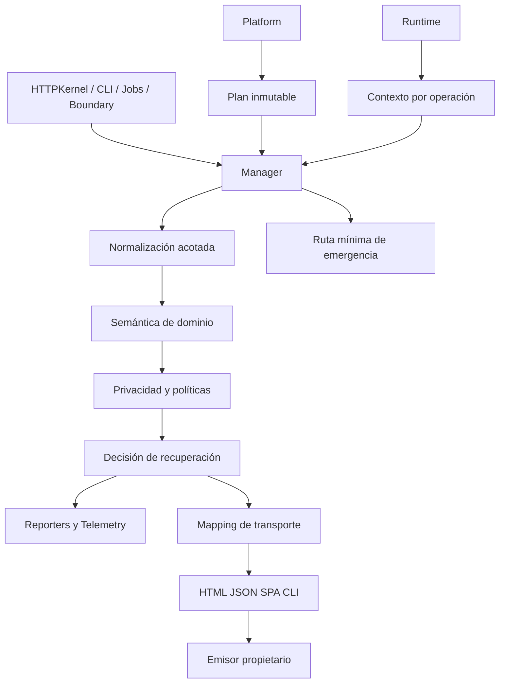

# 01 — Arquitectura del sistema de excepciones

**VoltStack / Quantum / Exceptions · Especificación técnica propuesta 1.0 · 4 de octubre de 2026**

## Objetivo y capas

ExceptionManager coordina componentes pequeños. La aplicación lanza excepciones de dominio y registra reglas mediante una fachada ergonómica; la infraestructura obtiene resultados tipados. Se adopta la separación report/render como inspiración de [Laravel](https://laravel.com/framework/docs/12.x/errors), y la composición mediante kernel, normalización y extensiones como inspiración de [Symfony HttpKernel](https://symfony.com/doc/current/components/http_kernel.html). Las clases y el protocolo de VoltStack son propios; no se heredan handlers de esos frameworks.

## Paquetes y dirección de dependencias

| Paquete propuesto | Contenido | Dependencias permitidas |
|---|---|---|
| `voltstack/quantum-exceptions` | contratos, modelo, manager, mapping, política | PHP, contratos internos básicos |
| `voltstack/exceptions-http` | HTTP exceptions, respuesta, negociación HTML/JSON | núcleo y HTTP |
| `voltstack/exceptions-spa` | envelope, boundaries y bridge reactivo | núcleo, HTTP y contrato SPA |
| `voltstack/exceptions-console` | stderr, salida JSON, exit mapping | núcleo, consola |
| `voltstack/exceptions-jobs` | failure envelope, retry advice | núcleo, Jobs |
| `voltstack/exceptions-telemetry` | trazas, métricas y exportación | núcleo, Telemetry |
| `voltstack/exceptions-runtime` | captura PHP y scope lifecycle | núcleo, Runtime |

Platform instala providers y bridges; el núcleo no busca servicios por nombres globales. Reporting usa un DTO saneado y no necesita renderizar una Response. El renderer conoce una vista pública y un plan de transporte, nunca el Throwable. La captura PHP vive en el bridge de runtime porque registrar handlers es una acción global del proceso.

## Autoridades y límites

El módulo de origen determina si una operación produjo efectos. Exceptions clasifica y representa ese dato; no consulta silenciosamente Database para adivinarlo. HTTPKernel conoce si se enviaron bytes; Jobs conoce ACK y reentrega; Runtime conoce si un worker puede reutilizarse. El manager entrega una decisión a esas autoridades y no reemplaza sus garantías.

Un plugin no puede saltarse saneamiento ni enviar directamente una respuesta desde un reporter. Las extensiones reciben capacidades mínimas y presupuestos; el orden no depende del orden de carga accidental. El núcleo permite aplicaciones CLI sin servidor, aplicaciones sin SPA y aplicaciones sin Telemetry.

## Verificación arquitectónica

Una prueba de dependencias debe instalar el núcleo sin bridges, normalizar un RuntimeException y producir un resultado de propagación. Las pruebas de arquitectura rechazan imports del núcleo hacia HTTP/Database/Container. En una aplicación completa, el mismo error de dominio debe conservar su código al pasar por HTTP, CLI y Jobs, con políticas de transporte distintas. La ausencia de un exporter no impide responder.

---

[Índice](00_EXCEPTION_SYSTEM_PROJECT_CONTEXT.md) · [Anterior](00_EXCEPTION_SYSTEM_PROJECT_CONTEXT.md) · [Siguiente](02_PUBLIC_CONTRACTS_AND_DOMAIN_MODEL.md)
