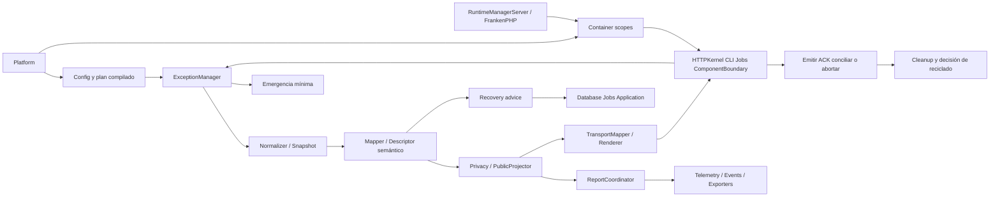

# 40 — Integración del sistema y arquitectura final

**VoltStack / Quantum / Exceptions · Especificación técnica propuesta 1.0 · 4 de octubre de 2026**

## Arquitectura final adoptada

`VoltStack/Quantum/Exceptions` es la autoridad de clasificación, políticas de reporte y resolución de errores. Platform lo compone mediante Container y Config; las fronteras de HTTPKernel, CLI, Jobs y componentes son dueñas de captura y finalización. Domain sigue independiente de transporte. Telemetry y Events reciben hechos saneados; RuntimeManagerServer conserva la autoridad sobre la vida del proceso.



## Matriz de integración y autoridad

| Sistema | Aporta a Exceptions | Conserva autoridad sobre |
|---|---|---|
| Quantum | contratos modulares y paquetes | independencia del núcleo |
| Platform/Container/Config | plan, servicios y scope | ensamblado y despliegue |
| HTTP/HTTPKernel | estado de emisión, perfil, entrada | headers/bytes y lifecycle real |
| Routing | ruta, métodos, perfil de representación | selección y Allow |
| Controllers | errores de aplicación o outcomes | ejecución de caso de uso |
| Authentication | identidad/challenge confiables | credenciales y sesión |
| Authorization | DENY/CHALLENGE/FAILURE tipados | evaluación, enforcement y auditoría |
| Validation | violaciones estructuradas | reglas y significado de fields |
| Database | clasificación técnica y effect | transacción, conexiones, UoW, outbox |
| Cache/Filesystem | metadatos y estados de efecto | coherencia, leases y consistencia de recursos |
| Jobs/Queues | intento, deadline, estado de entrega | ACK, reentrega y dead-letter |
| SPA reactiva | referencias de operación/componente | estado UI, revisiones y reconciliación cliente |
| Event System | puerto de publicación | transporte/durabilidad declarada |
| Telemetry | correlación e instrumentos | propiedad y exportación de spans |
| RuntimeManagerServer | scope y señales | reset, drain, reciclado y supervisión |

## Estructura lógica final

```text
VoltStack/Quantum/Exceptions/
  Contracts/        interfaces mínimas de 02
  Core/             Manager, Pipeline, Context, HandlingResult
  Model/            Snapshot, Descriptor, SemanticError, PublicError
  Catalog/          códigos, traducciones y esquemas
  Normalization/    extracción acotada y diagnóstico
  Mapping/          registry, resolución y planes
  Reporting/        policies, receipts y coordinator
  Recovery/         decisiones y presupuestos
  Privacy/          redactors y proyección pública
  Events/           records y puerto opcional
  Compilation/      validación y artefacto por release
Bridges/
  Http/ Html/ Json/ Spa/ Console/ Jobs/
  Telemetry/ EventSystem/ Database/ Security/ Runtime/
```

La estructura es lógica; no obliga a instalar todos los bridges juntos. Los namespaces de bridges pueden usar el prefijo Quantum\Exceptions con subnamespace, pero sus dependencias Composer permanecen separadas del núcleo. No se requiere heredar una excepción base universal para participar en el sistema.

## Flujo consolidado de una mutación SPA

FrankenPHP abre scope → HTTPKernel normaliza request → Routing define perfil SPA → Authentication/Authorization verifican → Validation valida → Controller llama dominio/Database. Si se lanza Throwable, el dueño transaccional aporta effect y cleanup. Manager normaliza, mapea, sanea, calcula advice, cuenta y reporta. TransportMapper produce envelope SPA con status real; kernel emite una vez. El cliente valida operation/navigation/component revision y reconcilia según efecto. Finalmente los módulos liberan recursos y Runtime decide reutilizar worker.

Si commit ya ocurrió, un error posterior no lo revierte. Si el stream comenzó, no se reemplaza su status. Si reporter falla, continúa salida segura. Si el estado del worker no es confiable, se retira. Estas reglas tienen precedencia sobre conveniencia de helpers, plugins o fallback visual.

## Alcance V1 y capacidades posteriores

V1 especifica núcleo, HTTP/HTML/Problem JSON, CLI, SPA error v1 y boundaries, reporting, eventos, privacidad, recovery advice, integración Jobs/Database, compilación y perfil FrankenPHP. Las integraciones no disponibles en las referencias se implementarán contra sus puertos propuestos y se validarán con los propietarios de esos sistemas. RoadRunner/OpenSwoole conservan el mismo modelo pero requieren adapters y certificación antes de declararse soportados. Exporters de terceros y perfiles legacy son opt-in.

## Criterio de terminación de implementación

Una implementación es compatible cuando cumple los contratos 02, catálogo 06, protocolo 16 y configuración 31; supera gates de 38 con evidencia; demuestra cero fuga entre scopes y datos públicos saneados; conserva semántica de efectos; no duplica emisión ni retries; y publica límites y matriz real de runtime. Performance se mide, no se infiere por tener plan compilado.

La colección documental sí queda terminada aquí: contiene los 41 archivos cerrados en 00, navegación interna, fuentes y matriz de aceptación. `validation.json` describe únicamente comprobaciones realizadas sobre los artefactos y `manifest.json` permite verificar inventario. No se presenta esa validación como pruebas de una implementación inexistente. Las referencias originales permanecen intactas.

---

[Índice](00_EXCEPTION_SYSTEM_PROJECT_CONTEXT.md) · [Anterior](39_REFERENCE_SCENARIOS_DECISIONS_AND_SOURCES.md)
